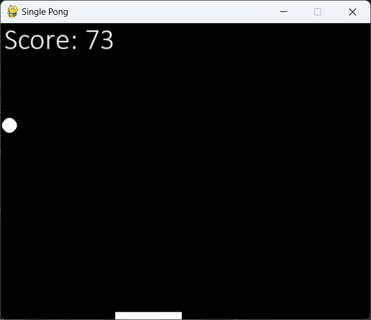

# Single Pong Game with Pygame



---

## How to run the Game?

Clone this repo:

```
git clone https://github.com/YaroslavRybakEducation/Single-Pong-Game.git
cd Single-Pong-Game
```

And run the Python file. **(Requires 3.13 or higher)**

If you have any problems, feel free to create new issue above.

Thanks. 😉